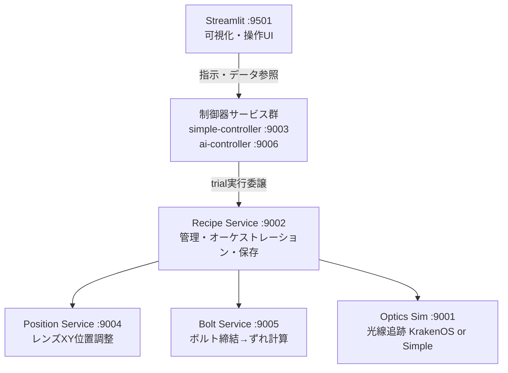
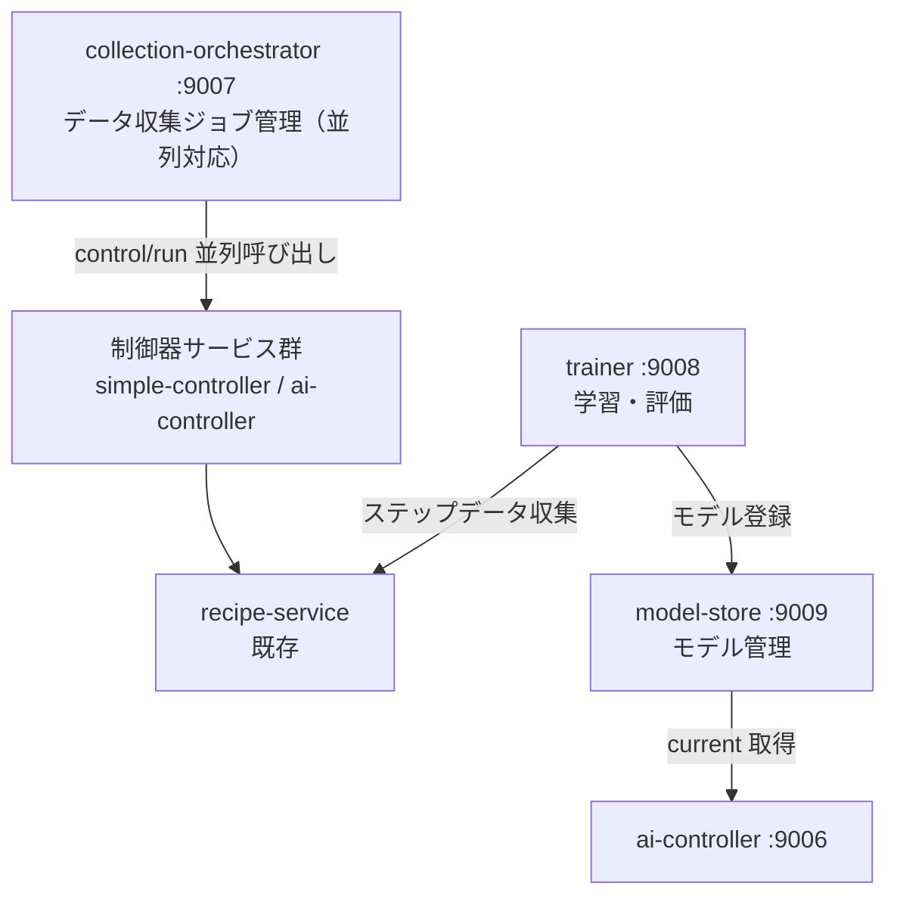
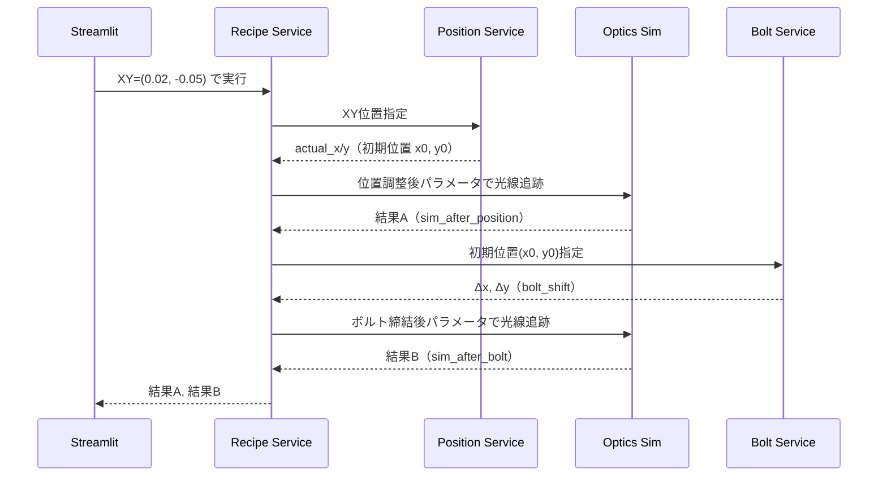
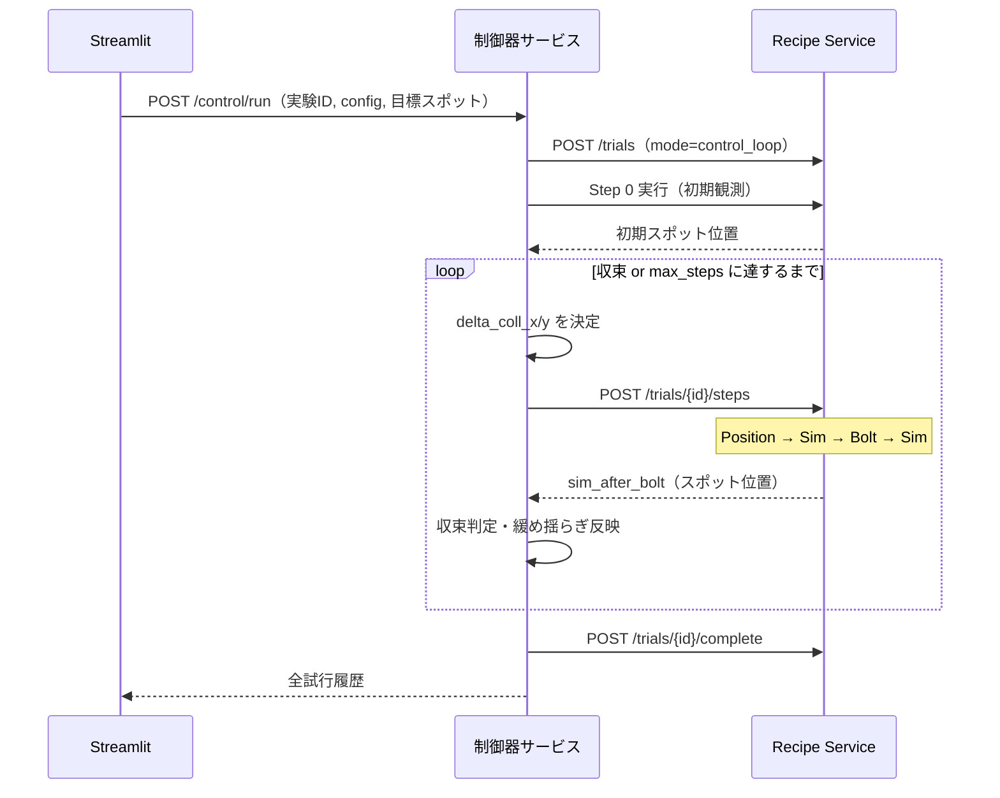

# アーキテクチャ概要

## システム構成図

### 制御系



### 学習・モデル管理系



## 座標系定義

```
        Y (Fast axis)
        ↑
        │
        │
  Z ────┘──→ X (Slow axis)
  (光軸)

  光の進行方向: +Z

  LD → [コリメートレンズ] →→→ [対物レンズ] → 観測面
                          Z軸 (光軸)
```

| 軸 | 方向 | 対応 |
|----|------|------|
| X | 水平（紙面左右） | Slow axis, `coll_x_shift`, `ld_emit_w` |
| Y | 垂直（紙面上下） | Fast axis, `coll_y_shift`, `ld_emit_h` |
| Z | 光軸方向 | `dist_ld_coll`, `dist_coll_obj`, `sensor_pos` |

## サービス一覧

| # | サービス | Port | 技術スタック | 責務 |
|---|---------|------|------------|------|
| 1a | optics-sim (KrakenOS) | 9001 | Python, KrakenOS, FastAPI | 精密光線追跡計算 |
| 1b | optics-sim (Simple) | 9011 | Python, NumPy, FastAPI | 高速ガウシアンモデル計算 |
| 2 | recipe-service | 9002 | Python, FastAPI | オーケストレーション・データ保存 |
| 3 | simple-controller | 9003 | Python, FastAPI | 比例制御ベースライン |
| 4 | position-service | 9004 | Python, FastAPI | レンズXY位置設定 |
| 5 | bolt-service | 9005 | Python, FastAPI | 初期位置→位置ずれ変換 |
| 6 | ai-controller | 9006 | Python, PyTorch, FastAPI | AI制御（MLP残差補正） |
| 7 | collection-orchestrator | 9007 | Python, FastAPI | 並列データ収集ジョブ管理 |
| 8 | trainer | 9008 | Python, PyTorch, FastAPI | モデル学習・評価・昇格 |
| 9 | model-store | 9009 | Python, FastAPI | モデルバージョン管理 |
| 10 | streamlit-app | 9501 | Python, Streamlit | UI・可視化 |

**注**: optics-simは2つのエンジンが選択可能：
- **KrakenOS版**（1a）: 厳密な光線追跡、全パラメータ使用
- **Simple版**（1b）: ガウシアンモデル、高速・省パラメータ

実験作成時に `engine_type` で選択。Recipe Service が自動的に適切なエンドポイントを呼び出す。

## 疎結合の原則

- 全サービス間通信は HTTP JSON API のみ
- 各サービスは他サービスの内部実装を知らない
- Optics Sim はレンズ位置がどう決まったかを知らない
- Bolt Service は光学系パラメータを知らない
- Position Service はボルトの存在を知らない
- Recipe Service だけが実行順序を知るオーケストレーター

## 典型的な実行フロー

### 手動実行（1ステップ）



### 制御ループ



制御器共通仕様は [05-controller.md](./05-controller.md) を参照。
初回実装サービスは [10-simple-controller.md](./10-simple-controller.md) を参照。
