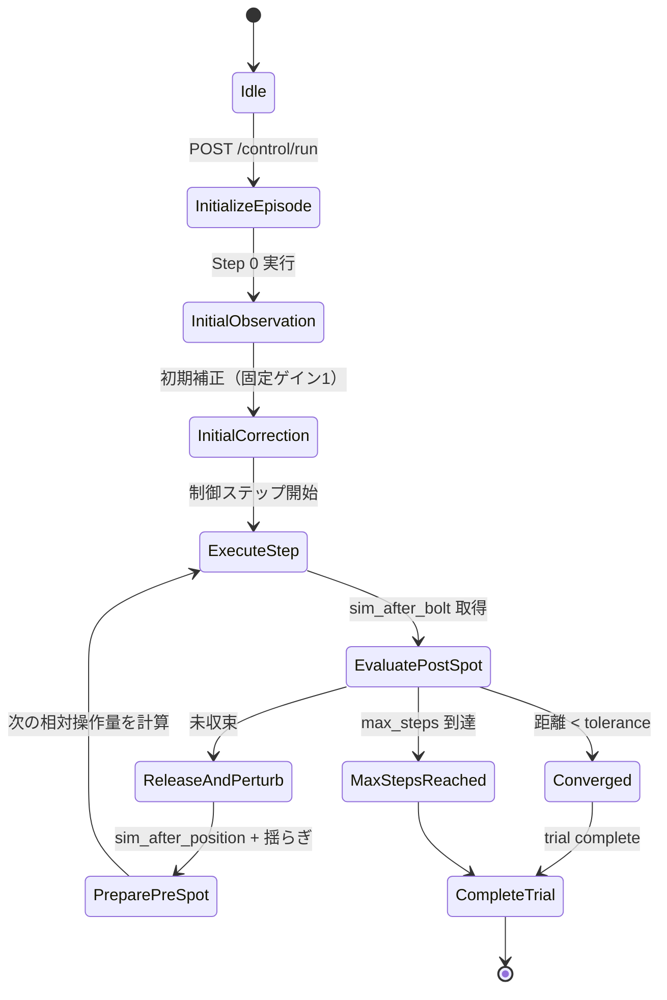
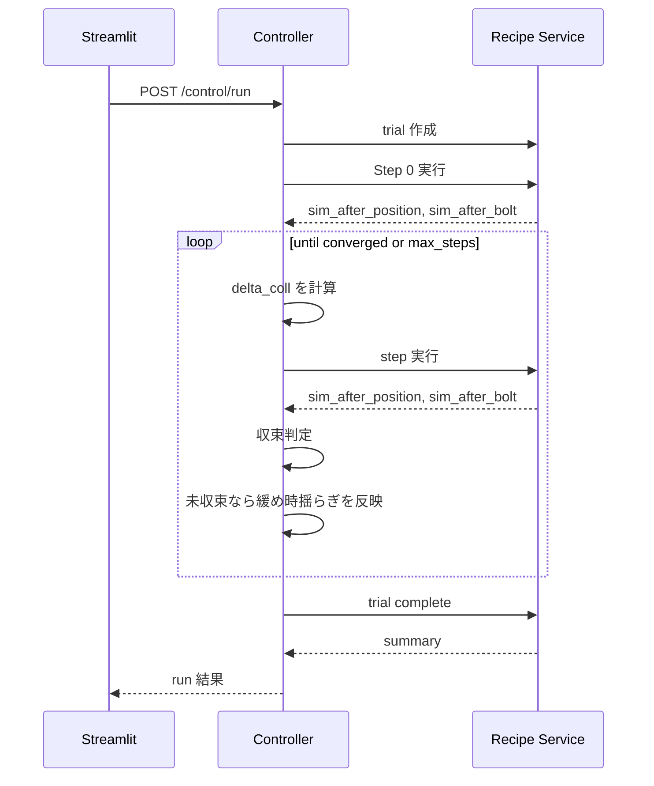

# 制御器共通仕様

- **役割**: 制御器サービス群が共通で満たす API 契約、状態管理、ループ構造を定義する。
- **依存**: recipe-service（試行開始・step実行・試行完了を委譲）
- **備考**: 実際のサービス仕様は個別ドキュメントで定義する。初回実装は [10-simple-controller.md](./10-simple-controller.md) を参照。

## 基本仕様

制御器サービスは Recipe Service の step 実行 API を繰り返し呼び出し、観測結果に基づいて次の XY 調整量を決定する。

### 基本方針

- 制御器の出力は **絶対位置ではなく相対操作量** `delta_coll_x`, `delta_coll_y`
- `POST /control/run` では 1 回の呼び出し内でループ状態を保持するが、**リクエストをまたいだ永続状態は持たない**
- `POST /control/step` はステートレスで、呼び出し側が必要な状態をすべて渡す
- 収束判定は常に **`sim_after_bolt` のスポット中心** を使う
- 制御開始前に **Step 0（初期観測）** を 1 回実行する
- Step 0 は `max_steps` に含めない

### 制御ループで扱う状態

| 項目 | 意味 |
|------|------|
| `current_coll_x`, `current_coll_y` | 現在の commanded XY 位置 |
| `spot_pre_x`, `spot_pre_y` | XY 調整前スポット。前ステップの `sim_after_position` に緩め時揺らぎを加えた値 |
| `spot_post_x`, `spot_post_y` | 前ステップの `sim_after_bolt`。収束判定やアルゴリズム拡張用に参照 |
| `target_spot_center_x`, `target_spot_center_y` | 目標スポット中心 |

### 収束判定

`sim_after_bolt` のスポット中心で判定する。

$$
\sqrt{(x_{\text{post}} - x_{\text{target}})^2 + (y_{\text{post}} - y_{\text{target}})^2} < \text{tolerance}
$$

- 1 回条件を満たせば収束とする
- `max_steps` 到達時は `converged: false` で終了する

## API

### `POST /control/run`

単一エピソードの制御ループ全体を実行する。

#### Request Body

```jsonc
{
  "experiment_id": "exp_001",
  "algorithm": "simple-controller",
  "config": {
    "...": "algorithm固有設定"
  },
  "target": {
    "spot_center_x": 0.0,
    "spot_center_y": 0.0
  },
  "initial_coll": {
    "coll_x": 0.0,
    "coll_y": 0.0
  },
  "max_steps": 20,
  "tolerance": 0.005
}
```

#### Response (200)

```jsonc
{
  "trial_id": "trial_003",
  "algorithm": "simple-controller",
  "converged": true,
  "steps": 7,
  "final_spot_center_x": 0.0004,
  "final_spot_center_y": -0.0003,
  "final_spot_rms_radius": 0.004,
  "final_distance": 0.0005
}
```

### `POST /control/step`

1 ステップ分の制御指令のみ計算する。Recipe Service は呼ばない。

#### Request Body

```jsonc
{
  "algorithm": "simple-controller",
  "config": {
    "...": "algorithm固有設定"
  },
  "state": {
    "target_spot_center_x": 0.0,
    "target_spot_center_y": 0.0,
    "current_coll_x": 0.05,
    "current_coll_y": -0.02,
    "spot_pre_x": 0.012,
    "spot_pre_y": -0.008,
    "spot_post_x": 0.018,
    "spot_post_y": -0.014,
    "step_index": 3,
    "history": []
  }
}
```

#### Response (200)

```jsonc
{
  "delta_coll_x": 0.012,
  "delta_coll_y": 0.008,
  "next_coll_x": 0.062,
  "next_coll_y": -0.012,
  "converged": false,
  "info": {
    "error_x": 0.012,
    "error_y": 0.008,
    "distance_pre": 0.014,
    "distance_post": 0.023
  }
}
```

### `GET /control/algorithms`

利用可能アルゴリズム一覧と設定スキーマを返す。

#### Response (200)

```jsonc
{
  "algorithms": [
    {
      "name": "simple-controller",
      "description": "相対操作量を返すシンプル制御器",
      "config_schema": {
        "type": "object"
      }
    }
  ]
}
```

### `GET /health`

```jsonc
{"status": "ok", "service": "simple-controller", "version": "0.1.0"}
```

## エラーレスポンス定義

| ステータス | 条件 | 内容 |
|-----------|------|------|
| 200 | 正常完了（収束・打ち切り両方含む） | 制御結果 |
| 404 | 実験ID未存在 | `{"detail": "experiment not found"}` |
| 422 | パラメータ不正 | FastAPI標準のバリデーションエラー |
| 502 | Recipe Service 障害 | `{"detail": "recipe-service error: <内容>"}` |
| 504 | Recipe Service タイムアウト | `{"detail": "timeout calling recipe-service"}` |

## 状態管理

| API | 状態保持 | 説明 |
|-----|----------|------|
| `/control/run` | 1 リクエスト内のみ | ループ中の履歴、現在 commanded 位置、収束判定用状態をメモリ保持 |
| `/control/step` | なし | 呼び出し側が `state` と `history` を与える |

`history` は将来の高度な制御器のために共通フィールドとして残す。simple-controller では直近状態のみを主に使用する。

## 状態遷移図



## シーケンス概要



## アルゴリズム個別仕様

- 共通 API に準拠しつつ、各サービス固有の `config`、`state` 解釈、`info` フィールドは別ドキュメントで定義する
- 初回実装サービスは [10-simple-controller.md](./10-simple-controller.md)
- 将来追加候補: PID-controller、ベイズ最適化-controller、モデル予測制御-controller
