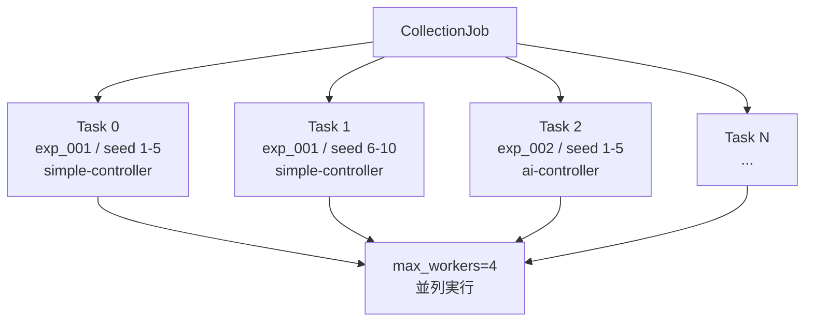

# Collection Orchestrator 仕様

- **Port**: 9007
- **役割**: DNN 学習用のデータ収集ジョブを管理する。複数の実験条件セットに対して制御ループを **並列実行** し、recipe-service にステップデータを蓄積する。
- **依存**: recipe-service, simple-controller, ai-controller

## 基本設計

### 並列実行モデル

1 つのコレクションジョブは複数の **タスク** に分解される。



タスクは `asyncio` の並行実行（または `concurrent.futures.ThreadPoolExecutor`）で処理する。  
`max_workers` で同時実行数を制限する（デフォルト: 4）。

### ジョブ IDの採番

```
job_id = "cjob_{YYYYMMDD}_{HHMMSS}_{4桁連番}"
```

タスク内の trial は recipe-service が発番（既存の自動連番）。ジョブ ID との紐付けは各タスクのメタ情報に保持する。

## API

### `POST /jobs`

コレクションジョブを作成して即時実行を開始する。

#### Request Body

```jsonc
{
  "job_id": "cjob_20260510_120000_0001",  // 省略時は自動採番
  "algorithm": "simple-controller",       // "simple-controller" | "ai-controller"
  "controller_config": {                  // 使用する制御器の config
    "spot_to_coll_scale_x": 50.0,
    "spot_to_coll_scale_y": 50.0,
    "delta_clip_x": 0.1,
    "delta_clip_y": 0.1,
    "coll_x_min": -0.5,
    "coll_x_max": 0.5,
    "coll_y_min": -0.5,
    "coll_y_max": 0.5
  },
  "target": { "spot_center_x": 0.0, "spot_center_y": 0.0 },
  "initial_coll": { "coll_x": 0.0, "coll_y": 0.0 },
  "max_steps": 10,
  "tolerance": 0.05,
  "tasks": [
    {
      "experiment_id": "exp_001",
      "seeds": [1, 2, 3, 4, 5]           // 各 seed で 1 trial を実行
    },
    {
      "experiment_id": "exp_002",
      "seeds": [1, 2, 3, 4, 5]
    }
  ],
  "max_workers": 4                        // 同時実行タスク数
}
```

#### Response (202)

```jsonc
{
  "job_id": "cjob_20260510_120000_0001",
  "status": "running",
  "total_tasks": 10,
  "created_at": "2026-05-10T12:00:00Z"
}
```

### `GET /jobs/{job_id}`

ジョブの進捗・結果を返す。

#### Response (200)

```jsonc
{
  "job_id": "cjob_20260510_120000_0001",
  "status": "completed",           // "running" | "completed" | "failed" | "partial"
  "total_tasks": 10,
  "completed_tasks": 10,
  "failed_tasks": 0,
  "started_at": "2026-05-10T12:00:00Z",
  "finished_at": "2026-05-10T12:05:30Z",
  "task_results": [
    {
      "experiment_id": "exp_001",
      "seed": 1,
      "trial_id": "trial_015",
      "converged": true,
      "steps": 6
    }
  ]
}
```

### `GET /jobs`

ジョブ一覧を返す。クエリパラメータ `status` でフィルタ可能。

## 実験条件セットの生成支援

### `POST /jobs/from-sweep`

bolt model の各パラメータにグリッドを指定し、実験条件を自動生成してジョブを組む。

実験作成（recipe-service への POST /experiments）も内部で行う。

#### Request Body

```jsonc
{
  "base_optical_system": { "...": "..." },  // 固定の光学系パラメータ
  "bolt_sweep": {
    "a_x": [0.01, 0.02, 0.05],
    "b_x": [1.0],
    "x0_bias_x": [0.0, 0.05, -0.05]
    // ...その他パラメータは base_bolt_model から取る
  },
  "base_bolt_model": { "...": "..." },
  "seeds_per_experiment": 5,
  "algorithm": "simple-controller",
  "controller_config": { "...": "..." },
  "max_steps": 10,
  "tolerance": 0.05,
  "max_workers": 4
}
```

これにより `3 × 1 × 3 = 9` 実験 × `5` seeds = 45 trials が並列収集される。

## ファイル構成

```
services/collection-orchestrator/
  Dockerfile
  requirements.txt
  app/
    __init__.py
    main.py        # FastAPI エントリポイント
    job_runner.py  # 並列タスク実行エンジン
    sweep.py       # グリッドスイープ用実験条件生成
    models.py      # Pydantic モデル
    clients.py     # recipe-service, 制御器サービス クライアント
    storage.py     # ジョブ状態のメモリ/ファイル保存
```
