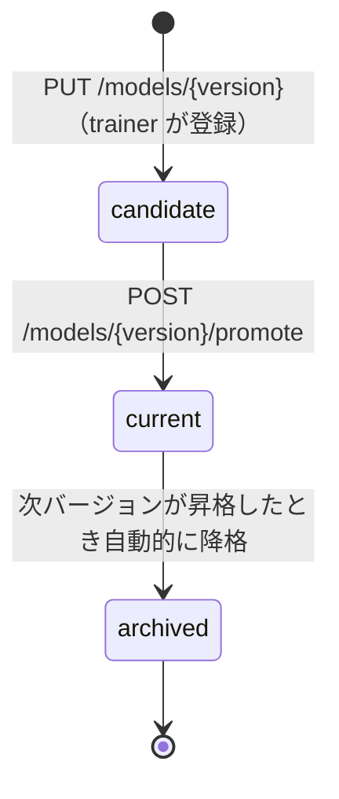

# Model Store 仕様

- **Port**: 9009
- **役割**: 学習済みモデルのバージョン管理。モデル本体ファイルと設定メタ情報を保存し、`current` / `candidate` / `archived` の状態を管理する。
- **依存**: なし（他サービスから依存される）

## バージョン管理

### モデル状態

| 状態 | 説明 |
|------|------|
| `current` | ai-controller が実際に推論に使用。常に 1 つ |
| `candidate` | 学習完了・評価待ち。昇格後は `current` になる |
| `archived` | 旧バージョン。読み取りは可能、推論には使用しない |



### バージョン ID

```
v1, v2, v3, ...（自動採番）
```

初期状態（モデル未学習）には特殊バージョン `v0` を割り当て、`model_type = baseline_only` として扱う。

## データ保存構成

モデルファイルはローカルの Docker Volume にファイルとして保存する。

```
/models/
  current -> v3/          # シンボリックリンク（または meta.json で管理）
  v0/
    meta.json
  v1/
    model.pt
    meta.json
  v2/
    model.pt
    meta.json
  v3/
    model.pt
    meta.json
```

### meta.json の形式

```jsonc
{
  "version": "v3",
  "model_type": "mlp",
  "mlp_config": {
    "hidden_sizes": [64, 64],
    "input_dim": 12,
    "output_dim": 2
  },
  "status": "current",
  "train_job_id": "tjob_20260510_120000_0001",
  "benchmark_metrics": {
    "median_final_error_mm": 0.018,
    "p95_final_error_mm": 0.045,
    "converge_rate": 0.92
  },
  "created_at": "2026-05-10T12:30:00Z",
  "promoted_at": "2026-05-10T12:31:00Z"
}
```

## API

### `GET /models/current`

現在の current バージョンのメタ情報を返す。

#### Response (200)

```jsonc
{
  "version": "v3",
  "model_type": "mlp",
  "status": "current",
  "benchmark_metrics": { "...": "..." },
  "created_at": "2026-05-10T12:30:00Z"
}
```

### `GET /models/current/file`

current モデルの `.pt` ファイルをバイナリで返す。ai-controller の起動時・リロード時に使用。

### `GET /models/{version}`

指定バージョンのメタ情報を返す。

#### Response (200)

```jsonc
{
  "version": "v1",
  "model_type": "mlp",
  "status": "current",
  "benchmark_metrics": {
    "median_final_error_mm": 0.05,
    "p95_final_error_mm": 0.10,
    "converge_rate": 0.95
  },
  "benchmark_trial_ids": ["trial_001", "trial_002", "trial_003"],
  "benchmark_experiment_ids": ["exp_001"],
  "train_job_id": "train_job_000001",
  "created_at": "2026-05-10T12:30:00Z",
  "promoted_at": "2026-05-10T12:31:00Z"
}
```

### `POST /models`

Trainer が新しいモデルを登録。

#### Request Body

```jsonc
{
  "version": "v2",
  "model_type": "mlp",
  "status": "candidate",
  "benchmark_metrics": { "..." },
  "benchmark_trial_ids": ["trial_001", "trial_002"],
  "benchmark_experiment_ids": ["exp_001"],
  "train_job_id": "train_job_000002",
  "created_at": "2026-05-10T13:00:00Z"
}
```

#### Response (200)

リクエストと同じボディを返す（確認応答）。

### `POST /models/{version}/promote`

モデルを `candidate` から `current` に昇格。前の `current` は自動的に `archived` になる。

#### Request Body

```jsonc
{
  "version": "v2"
}
```

#### Response (200)

```jsonc
{
  "version": "v2",
  "new_status": "current",
  "promoted_at": "2026-05-10T13:05:00Z"
}
```

### `GET /models`

全モデル一覧。

#### Response (200)

```jsonc
{
  "models": [
    { "version": "v1", "model_type": "mlp", "status": "archived", "..." },
    { "version": "v2", "model_type": "mlp", "status": "current", "..." }
  ],
  "current_version": "v2"
}
```

### `GET /models/{version}/file`

指定バージョンの `.pt` ファイルをバイナリで返す。

### `GET /models`

全バージョンの一覧をメタ情報付きで返す。

#### Response (200)

```jsonc
{
  "models": [
    { "version": "v3", "model_type": "mlp", "status": "current", "...": "..." },
    { "version": "v2", "model_type": "mlp", "status": "archived", "...": "..." },
    { "version": "v0", "model_type": "baseline_only", "status": "archived", "...": "..." }
  ]
}
```

### `PUT /models/{version}`

モデルファイルとメタ情報を登録または更新する（trainer が学習完了後に呼び出す）。

#### Request

`multipart/form-data`:
- `file`: `.pt` ファイル（`baseline_only` は不要）
- `meta`: JSON 文字列（`meta.json` の内容）

#### Response (201)

```jsonc
{ "version": "v4", "status": "candidate" }
```

### `POST /models/{version}/promote`

指定バージョンを `current` に昇格させる。現行の `current` は `archived` になる。

#### Response (200)

```jsonc
{ "version": "v4", "status": "current", "previous_current": "v3" }
```

## ファイル構成

```
services/model-store/
  Dockerfile
  requirements.txt
  app/
    __init__.py
    main.py      # FastAPI エントリポイント
    storage.py   # ファイル保存・バージョン管理ロジック
    models.py    # Pydantic モデル
```
