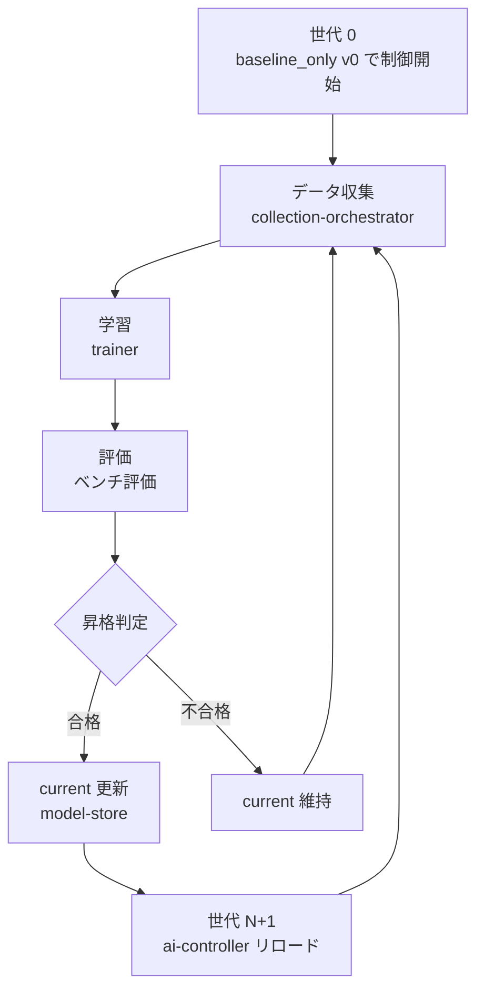
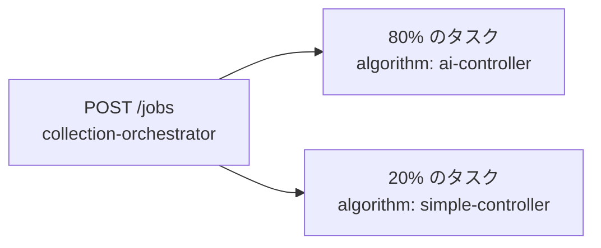

# 反復学習戦略

AI 制御モデルを段階的に育てるための、データ収集 → 学習 → 評価 → 昇格 → 再収集のサイクルを定義する。

## 全体フロー



各世代は手動でトリガーする（自動化は将来対応）。

---

## 世代 0: 初期データ収集

学習前に baseline_only で十分なデータを収集する。

### 手順

1. Streamlit の実験作成ページで **複数の bolt model 条件**を持つ実験を作成する
   - 最低 5 実験、推奨 10 実験以上
   - a_x, x0_bias_x, noise_ratio などを変えてカバレッジを確保する
2. collection-orchestrator の `POST /jobs/from-sweep` でデータ収集を一括実行する
   - `seeds_per_experiment = 10` 以上
   - `algorithm = simple-controller`
3. 収集後に `GET /jobs/{job_id}` で全タスクが完了していることを確認する

### 最小データ量の目安

| 指標 | 最小値（設定可能） |
|------|------|
| 総ステップ数 | 500 ステップ |
| 実験数 | 5 実験 |

---

## 世代 N: 学習サイクル

### ステップ 1: 学習データ収集

前世代モデル（または baseline）で制御を実行してデータを収集する。

- **探索混合率**: 全タスクの 20% は `simple-controller`（baseline）を使用し、残り 80% は `ai-controller` を使用する
  - baseline からのデータを混ぜることで、DNN の過学習・データ偏りを防ぐ
- 世代ごとに bolt_model 条件のレンジを少しずつ広げる（汎化能力の向上）



### ステップ 2: 学習ジョブ実行

trainer の `POST /train` を呼び出す。

```jsonc
{
  "model_type": "mlp",
  "mlp_config": { "hidden_sizes": [64, 64], "learning_rate": 1e-3, "epochs": 100 },
  "data_filter": { "min_steps": 500 },
  "benchmark": {
    "experiment_ids": ["bench_exp_001", "bench_exp_002", "bench_exp_003"],
    "seeds": [901, 902, 903, 904, 905],
    "max_steps": 10,
    "tolerance": 0.05
  }
}
```

**注**: ベンチ用実験（`bench_exp_*`）は世代を通じて変えない。固定した条件で世代間比較ができるようにする。

### ステップ 3: 評価・昇格判定

trainer 内部で自動的に実行される。`GET /train/{train_job_id}` で結果を確認する。

- `promoted: true` → model-store の current が更新済み
- `promoted: false` → 現行モデルを維持、理由を `benchmark_results` で確認する

### ステップ 4: モデルリロード

昇格が成功した場合、ai-controller のモデルをリロードする。

```
POST /model/reload  (ai-controller)
```

### ステップ 5: 次世代へ

ステップ 1 に戻る。収集するデータは前世代のデータに **累積で追加**する（捨てない）。  
ただし、baseline からのデータは各世代で一定割合を維持する。

---

## ベンチ実験の管理

学習に使うデータとは別に、**評価専用の実験セット**を固定して維持する。

### 作成タイミング

- プロジェクト最初の一度だけ作成する
- 実験名に `bench_` プレフィックスをつけて区別する

### 推奨条件

- 3〜5 実験
- bolt model の典型的な条件を代表するもの（弱め・中程度・強め）
- 学習データ生成に使った実験と **一致しない** seed で評価する

---

## 収束不良時の対処

| 状況 | 対処 |
|------|------|
| 評価中央値が改善しない | データ不足の可能性。収集実験数・seeds を増やす |
| P95 が悪化する | 特定条件への過学習の可能性。bolt_model 条件の多様性を増やす |
| 収束失敗率が増える | 安全ガードの閾値を下げる（DNN 補正を小さく制限する） |
| 全世代で改善しない | 特徴量設計の見直し。lower bolt unit のパラメータを追加するなど |

---

## 将来対応: オンライン学習

本ドキュメントの戦略はすべて **オフライン反復学習** を前提とする。

将来的にオンライン学習（各ステップの結果でリアルタイムに fine-tune する）を実装する場合は以下の要素が必要になる：

- collection-orchestrator または ai-controller にミニバッチバッファを追加
- 一定件数蓄積後に trainer への学習起動シグナルを送る
- 昇格判定の簡略化（逐次更新時はカナリア比較）
- ロールバック機構の強化

オフライン反復学習で十分な性能が得られた後に検討する。
